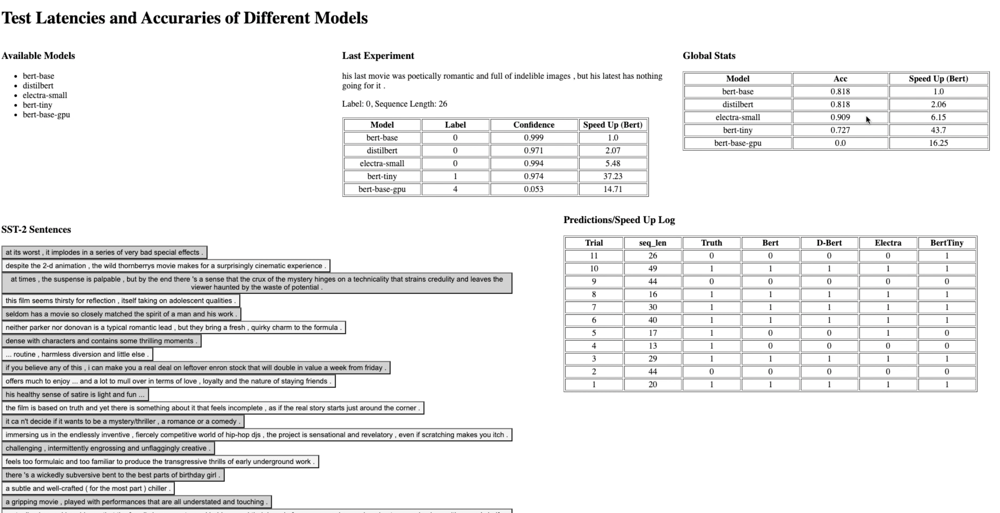
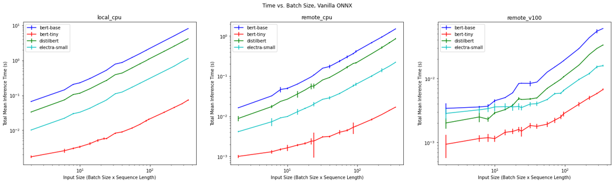
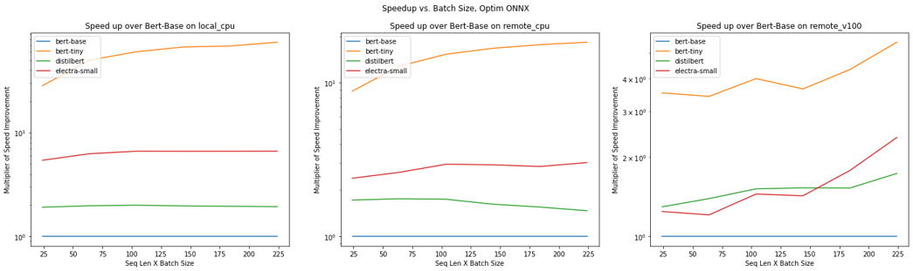
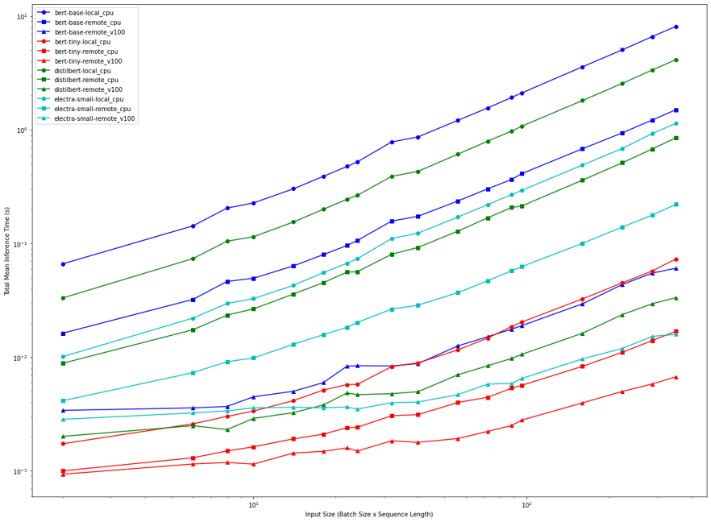
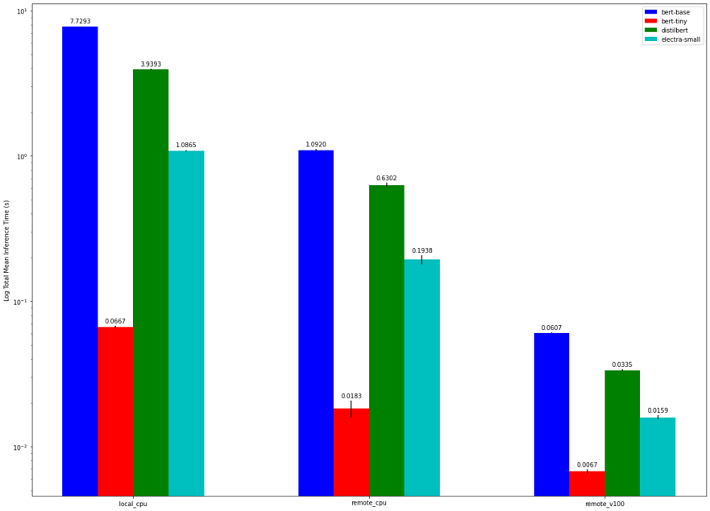
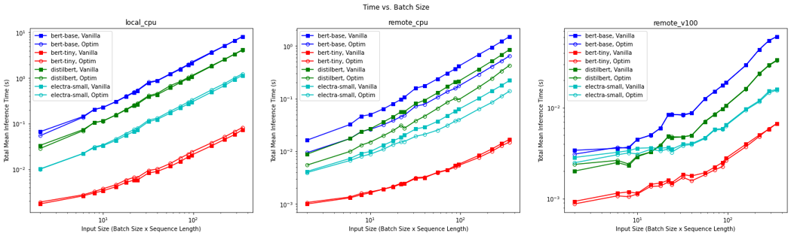

# practical-transformer-deployment
Final project for COMS E6998 Practical Deep Learning Systems Performance

## Code Layout

### Training and Preparation
`run_glue.py`: part of the Huggingface docs for training/evaluating models on the GLUE benchmark. We use it to finetune each of the models.

`finetune.sh`: convenience script for finetuning the models. Runs `run_glue.py` with specific parameters.

`setup.sh`: covenience script to set up the environment for experiments. Clones the repo, creates a conda environment using `environnment.yml`, and downloads/converts all the models.

### Experiments
`client.py`: entry point for experiments. Sends inference requests to the servers hosting models. Can optionally a full experiment: trials for all combinations of parameters.  
Example usage: `python client.py --run_full --num_trials 100`

`inference.py`: Flask app for hosting models. API includes `set_model` for loading a model from disk and `inference` for executing loaded model on inputs.  
Usage: `export FLASK_APP=inference && flask run --host=0.0.0.0 --port=5001`

### Utilities
`convert_graph_to_onnx.py`: this script is part of the ONNX runtime docs. It converts PyTorch models to ONNX, and can optionally optimize and quantize them.

`convert.sh`: convenience script to download and convert all 4 PyTorch models to ONNX.

`quantize.sh`: convenience script to download, convert, and quantize all 4 PyTorch models to ONNX.

## Demo

The creation of our tool is created with a model deployment focus in mind. When deploying a model to production, it is important to perform inferencing on real examples that your model will see. All the experiments in the subsequent sections are performed in idealized aggregated formats, which is important but not enough.

Our tool is designed for investigating the latencies and accuracies of different models. We host 5 models: BERTBase (CPU), BERTBase (GPU), ELECTRASmall (CPU), BERTTiny (CPU), DistilBERT (CPU). All models are trained on the SST-2 (sentiment) GLUE dataset. Below is a layout of the demo tool.

We provide a list of sentences from the test set of the SST-2 dataset. When a sentence is clicked, it passes through all 5 models, recording the prediction, confidence score, and inference speed (measured as a speed up over BERT-base). We record a log of all run trials including the true prediction and predictions by each model. We also log global stats across all run trials, such as accuracy and inference speed.

This demo is helpful because it allows for investigation into individual sentences, as mentioned above. This allows us to probe our models, highlight deficiencies, and gather true production setting metrics on inference speeds.

## Experiments and Results

**Case Study:** You are working on a sentiment model at your company. This task is latency conscious and you have access to limited resources (budgeted deployment). You want to assert to your team that your developed model is predictively powerful, yet fast enough to meet latency requirements.

Deployment Strategies:
* Model on device, single CPU core
* Model on server, multiple CPU cores
* Model on server, single GPU

Architecture Sizes
* BERT-base
* BERT-tiny
* DistilBERT
* ELECTRA-small

Hardware Versions
* Local: 1-core Skylake CPU (GCP N1 instance)
* Server (CPU): 8-core Skylake CPU (GCP N2 instance)
* Server (GPU): 1 x V100 GPU

### Model Summary

The table below summarizes the models we used in our project. Each model was finetuned on the SST-2 sentiment classification task from the GLUE benchmark.

As expected, BERT-base has the best performance, but it is the largest model by far. DistilBERT and ELECTRA-Small, which are distilled versions of BERT, have nearly the same performance but are significantly smaller. BERT-tiny is the smallest of the group, but suffers in performance due to its lack of distillation.

### Inference Time vs. Input Size

Below we can see the total inference time of each model for each of the hardware configurations. Unsurprisingly, the smaller models have faster inference.

The plots below show the speedup of each mode relative to BERT-base. Interestingly, for the GPU machine, the speedup increases for the smaller models as we increase input size. This is likely due to the GPU's parallelism, since it can achieve greater efficiency by processing more data at once. On the other hand, the CPUs saturate even with small inputs.    

### Evaluating all Combinations of Model and Hardware

We can combine all 3 ifnerence time plots above into a single graph, in order to visualize the tradeoffs between hardware and model. For each model, the GPU has the fastest inference, and the smaller models also have faster inference. We see that BERT-tiny (red circles) on a local CPU has roughly the same inference time as BERT-base on a remote GPU (blue triangles); for a higher hardware cost, we can therefore achieve significantly better predictive performance with the GPU. However, if we were willing to slightly increase our inference time, we could select ELECTRA-small on remote CPU (teal square). This would achieve better predictive performance than BERT-tiny, while undercutting the GPU's cost.  

To more clearly visualize the model-hardware comparison, we can take a snapshot of the largest input size:  

### ONNX Optimization

ONNX offers two types of optimizations: graph optimizations and quantization. To test their impact, we applied both optimization and quantization to the models on CPU and compared them to vanilla ONNX models. For GPU, we used graph optimization, but were unable to use quantization. Quantized ONNX models rely on TensorRT and require a GPU with Int8-supported tensor cores, such as a T4 or A100; we were unable to procure such a GPU for our experiments. We can see the results below. The local CPU and remote GPU do not benefit from these optimizations, but the remote CPU does. This is likely due to the fact that the newer N2 instances on GCP support vector instructions such as AVX-512 and Intel VNNI. This allows the remote CPU to take advantage of the quantized models' reduced precision. We would expect a GPU with Int8 support to show a similar, if not greater, speedup from quantization.  

